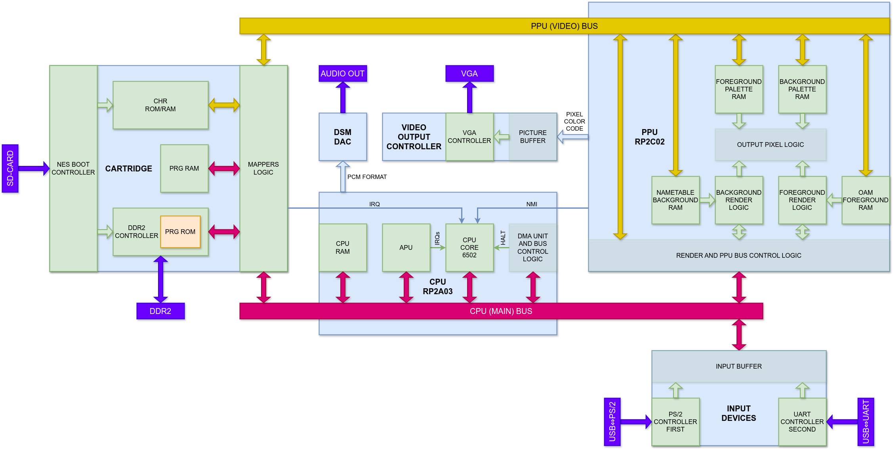
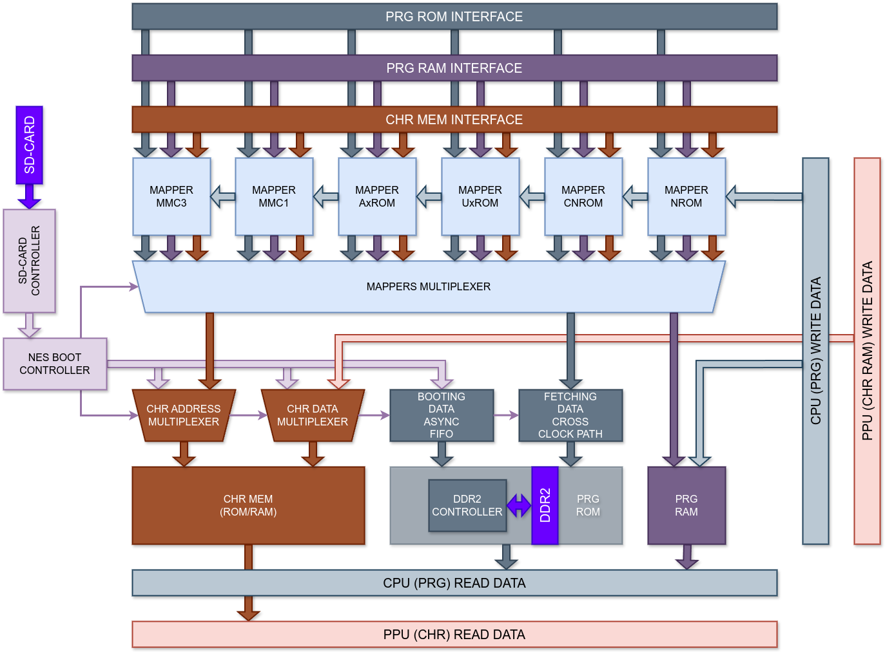
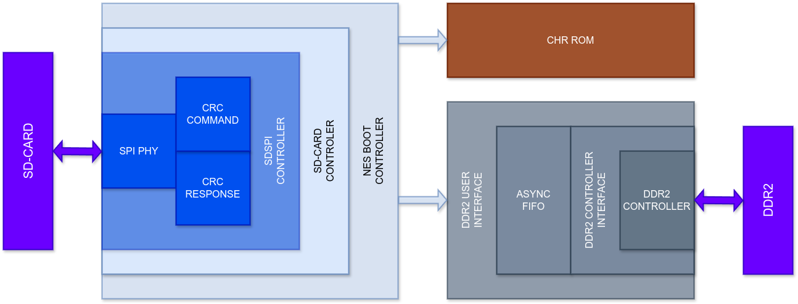

# Nexys 4 DDR FPGA NES

Имплементация игровой консоли **Nintendo Entertainment System (NES)** на FPGA

Исходный код проекта написан на языке описания аппаратуры Verilog

Проект предназначен для использования на плате Digilent Nexys 4 DDR (Nexys A7-100T)

Проект синтезировался в САПР Xilinx Vivado Design Suite v2023.1

В проекте испольуются проприетарные IP-блоки:

* Clocking Wizard, Version 6.0 (Rev. 12), Xilinx
* Memory Interface Generator (MIG 7 Series), Version 4.2 (Rev. 1), Xilinx

## Описание проекта

### Структура проекта

Проект реализует архитектуру игровой консоли NTSC версии, а также логику, необходимую для запуска образов игр для неё с microSD-карты на плате Nexys 4 DDR



Функционально проект состоит из следующих модулей:

* Имплементация микросхемы центрального процессора Ricoh RP2A03
* Имплементация микросхемы графического процессора Ricoh RP2C02
* Эмуляция присоединяемых к консоли картриджей
* Устройства ввода ("геймпадов")
* Устройство вывода изображения
* Устройство вывода звука

#### Модуль центрального процессора Ricoh RP2A03

Включает в себя:

* Ядро центрального процессора
* Оперативную память центрального процессора
* Ядро аудиопроцессора
* Логику приёма данных от устройств ввода NES
* Логику управления, арбитража и прямого доступа, относящейся к процессорной (системной для всей архитектуры NES) шине

Микросхема является центральным элементом всей системы. Главной её частью является 8-ми разрядное процессорное ядро, реализующее совместимую с MOS Technology 6502 архитектуру набора команд с классической для середины 70-х годов прошлого века аккумуляторной многотактной микроархитектурой. Помимо аккумуляторного регистра, обозначающегося в спецификациях "A", в ядре процессора присутствуют специальные индексные регистры "X" и "Y", предназначенные для реализации инструкций с косвенным типом адресации операндов, кроме того эффективно применяющихся для организации циклов в коде программы вследствие наличия отдельных быстрых инструкций инкремента и декремента содержимого этих регистров. Также в ядре присутствуют регистр процессорных флагов "P/PS", регистр указателя стека "S/SP" и 16-ти битный регистр указателя инсрукций "PC", формирующийся из двух 8-ми битных половин. К ядру присоединяется процессорная шина, имеющая линии для 16-ти разрядной адресации и передачи 8-ми разрядных данных. В основе имплементации этого ядра лежит конечный автомат, описывающий последовательное исполнение каждой отдельно взятой инструкции, а переходы между состояниями автомата осуществляются в зависимости от типа адресации операндов и варианта доступа к памяти исполняемой в данный момент инструкции и её промежуточных результатов. Текущая обрабатываемая инструкция и состояние конечного автомата определяют, какие сигналы, данные и адреса, которые далее поступают на АЛУ и процессорную шину, формирует устройство управления на каждом процессорном такте

Ядро аудиопроцессора состоит из 5-ти аудиоканалов-звукогенераторов: два "прямоугольных", "треугольный", "шумовой" и дельта модуляции (также называемый "сэмпловым"), а также логики их управления, синхронизации и смешивания. Первые четыре канала аудиопроцессора по своей сути являются звуковыми синтезаторами, в регистры которых код исполняемой игры записывает параметры воспроизводимого в данные момент звука: его частоту, длительность, громкость. В свою очередь канал дельта модуляции воспроизводит аудио либо в формате PCM (Pulse-code modulation, импульсно-кодовая модуляция, ИКМ), либо DPCM (Differential PCM, дифференциальная импульсно-кодовая модуляция, ДИКМ), то есть проигрывает "сэмплированную" (дискретизированную и квантованную определённым образом) амплитуду аудиосигнала. В случае, когда ядру центрального процессора нет необходимости обращаться к графическому процессору и управлять рендером анимации, его производительности будет достаточно, чтобы напрямую управлять выходом канала дельта модуляции, записывая 7-ми битные значения в специальный регистр, именуемый "Direct Load". Таким образом реализуется формат вывода PCM, который позволяет добиться наилучшего качества воспроизводимого звука (например, стартовая заставка в игре _Skate or Die 2: The Search for Double Trouble_). Но ввиду высоких требований к процессорному времени такой формат не может быть широко использован. Вместо него применяется формат DPCM, в котором воспроизводимый звук кодируется в виде разницы между текущим и следующим значением "аудиосэмпла", что в сочетании с применяемым здесь прямым доступом к памяти для записи следующих значений DPCM в регистры канала и с тем фактом, что "сэмплы" — это, как правило, циклично и непрерывно проигрывающийся звук, позволяет почти полностью освободить ядро центрального процессора от управления этим каналом. Смешивание выходов аудиоканалов производится с помощью специальных заранее подготовленных таблиц поиска (lookup table, LUT), с помощью которых (по специальной формуле, разработанной энтузиастами "реверс-инжениринга") выходные уровни аудиоканалов транслируются в значение на выходе всего аудиопроцессора в целом в формате PCM. Количество уникальных выходных уровней сравнительно невелико, что позволяет не использовать "дорогие" с точки зрения площади арифметические блоки для вычисления результатов "смешивания" и трансформации в PCM представление, а применять вместо них LUT, синтезирующийся в блочную память

Логика приёма данных от устройств ввода не выделена в отдельный модуль. По своей сути представляет собой пару регистров, обращение ядра процессора к которым позволяет ему считывать текущие состояния кнопок на устройствах ввода, хранящиеся в буферах в соответствующем модуле проекта

Процессорная-системная шина связывает ядро центрального процессора со всеми блоками NES: ПЗУ с исполняемым кодом игры (обычно обозначаемым как PRG ROM), ОЗУ ядра процессора, регистры аудиопроцессора, регистры устройств ввода, регистры графического процессора, регистр управления прямым доступом к памяти, регистры управления "мапперами" картриджей, ОЗУ картриджа (при его наличии). Логика управления процессорной шиной также не выделена в отдельный модуль, она управляет обращениями процессорного ядра к периферии, декодирует данные на адресных линиях, активируя регистры соответствующих элементов системы для записи, мультиплексирует принимаемые от них данные. Предоставляет доступ к шине контроллеру прямого доступа к памяти и, когда оно активно, генерирует сигнал останова для процессорного ядра. Сам контроллер ПДП устроен таким образом, чтобы копирование байта данных из одной области памяти в другую занимало два процессорных такта (чтение из исходной ячейки памяти — запись в регистр назначения). Прямой доступ используется при копировании графических данных для рендера переднего плана изображения, тогда он инициализируется исполняемым процессорным ядром кодом в момент, когда происходит запись старшего байта адреса, откуда будут копироваться данные, в специальный регистр в адресном пространстве процессора. Также прямой доступ используется при копировании очередного байта данных DPCM "сэмпла" в соответствующий буферный регистр, при этом сколько байт данных (всего, копируются и обрабатываются каналом они по одному) и откуда их копировать процессорное ядро настраивает через предназначенные для этого регистры канала дельта модуляции аудиопроцессора. Если запрос на прямой доступ к памяти придёт от канала дельта модуляции во время функционирования прямого доступа при копировании графических данных от ЦПУ к ГПУ, то произойдет переход управления шиной, потому что копирование данных для канала дельта модуляции имеет более высокий приоритет

#### Модуль графического процессора Ricoh RP2C02

Включает в себя:

* Ядро графического процессора
* Логику рендера заднего плана изображения
* Логику рендера переднего плана изображения
* Элементы оперативной видеопамяти различного назначения

Ядро графического процессора включает в себя отображённые на процессорную шину регистры состояния и управления ГПУ, внутренние регистры и блок управления шиной графического процессора для доступа как к постоянной, так и оперативной видеопамяти, счётчики строк и столбцов кадра, блок приоритетного мультиплексирования выходных пикселей заднего и переднего плана, генератор прерывания к центральному процессору

ЦПУ, обращаясь в определённой последовательности к регистрам "PPUSTATUS", "PPUSCROLL" и "PPUADDR" ГПУ, устанавливает значения во внутренние регистры (их два, они называются "текущий" и "временный") адреса видеопамяти, которые транслируют этот адрес на шину графического процессора. Вне рендера ЦПУ таким образом выставляет определённый адрес на шину графического процессора, чтобы затем с помощью обращений к регистру "PPUDATA" записать или прочитать данные из постоянной или оперативной видеопамяти NES. В ходе рендера ГПУ самостоятельно изменяет значения в регистрах адреса видеопамяти, чтобы последовательно отрисовывать изображение из заданной страницы оперативной видеопамяти, и изменение адреса на шине графического процессора центральным процессором в этот момент позволяет осуществлять "скроллинг", то есть принудительно перемещать отрисовываемый в данный момент участок оперативной видеопамяти. Каждый кадр состоит из 262 строк по 341 пиксель каждая, при этом видимая область изображения выводиться на экран в промежутке с 0-ой по 239-ую строку кадра включительно и с 1-го по 256-ой пиксель строки включительно. Получается разрешение 256 на 240 точек. Пустые строки, именуемые периодом "VBLANK", используются ЦПУ для изменения содержимого оперативной видеопамяти как для заднего, так и для переднего фона. Пустые пиксели в строке, именуемые соответственно периодом "HBLANK", используются для подготовки необходимых данных для рендера на следующей строке кадра

Графический процессор NES — знакосинтезирующий, это значит, что изображение формируется с помощью заранее определённых и сохранённых в постоянную графическую память знаков ("тайлов"), имеющих разрешение 8 на 8 пикселей. В отсутствие логики расширения адресного пространства ГПУ доступно 8 Кбайт графических данных (обычно обозначаемых как CHR ROM). Индексы (то есть адреса в постоянной видеопамяти) этих "тайлов", записанные в оперативную видеопамять заднего плана (эта видеопамять называется nametable) по определённым адресам, формируют отрисовываемое фоновое изображение. Сама оперативная видеопамять заднего плана разделяется на страницы по 1 Кбайту каждая таким образом, что каждая страница содержит в себе изображение с разрешением 32 на 30 "тайлов" (или 256 на 240 пикселей) и набор атрибутов (информации о цвете пикселей в этих "тайлах") к нему. Графический процессор NES поддерживает доступ по своей шине к 4-ём таким страницам, однако в оригинальной микросхеме ГПУ, устанавливавшейся в консоли, в целях уменьшения её стоимости присутствовало только 2 Кбайта, оставшиеся 2 Кбайта могли быть добавлены в пространство видеошины вместе с картриджем. Если же дополнительной оперативной видеопамяти на картридже не было, что справедливо для подавляющего большинства игр для NES, то вместо неё картридж конфигурировал (с помощью физической трассы между соответствующими сигнальными линиями или с помощью программируемой логики внутри микросхемы-"маппера") "отображение" (mirroring) физически присутствовавших в ГПУ страниц видеопамяти на адресное пространство, где их не было. При этом реализация используемого "отображения" зависела от типа "скроллинга", применявшегося в игре. Так, для игр с горизонтальным "скроллингом" удобнее всего было применять вертикальное "отображение", и наоборот. Для игр с двунаправленным "скроллингом" "отображение" могло переконфигурироваться обращениями ЦПУ к предназначенному для этого регистру микросхемы-"маппера"

Реализация рендера заднего плана изображения основана на конечном автомате. Он описывает циклические обращения логики сначала к оперативной видеопамяти, используя состояние внутренних регистров видеопамяти ГПУ, описанных ранее, для извлечения из неё данных об индексе очередного отрисовываемого "тайла" и его атрибутах (приеняемой к данному "тайлу" палитре), а затем — к постоянной видеопамяти по полученному индексу "тайла" с учётом текущей отрисовываемой строки кадра. Полученные из постоянной видеопамяти данные (2 бита кодируют цвет пикселя в постоянной памяти) помещаются в два сдвиговых регистра, и в ещё два таких же регистра помещаются данные атрибутов этого "тайла" (2 бита для выбора цвета пикселя в палитре). Наконец, на каждом такте ГПУ в отображаемой области кадра эти сдвиговые регистры выдают на выход логики рендера суммарно 4 бита, кодирующие цвет очередного пикселя

Реализация рендера переднего плана изображения так же, как и исполнение логики рендера для заднего плана, основана на конечном автомате и в определённом смысле похожа на него в части доступа к постоянной видеопамяти. ЦПУ перед каждым следующим кадром анимации, где используется передний план ("спрайты") с помощью прямого доступа к памяти обновляет содержимое оперативной видеопамяти данных переднего плана. Это происходит, даже если данные с предыдущего кадра не поменялись, ввиду того, что в оригинальной микросхеме ГПУ NES эта память была реализована на ячейках, требующих постоянной регенерации. Объем этой памяти — 256 байт данных, что позволяет хранить в ней информацию о 64 "спрайтах" на кадр, по 4 байта данных на "спрайт". Данные, которые описывают каждый отдельный "спрайт" — это индекс использующегося "тайла", атрибуты (палитра, приоритет над задним планом, геометрия, то есть отражение либо по горизонтали, либо по вертикали), применяемые к "тайлу", и координаты левого верхнего угла "тайла" в видимой области изображения по горизонтали и по вертикали, это номер строки и номер пикселя в строке, с которых "спрайт" начинает отрисовываться. Для осуществления рендера данные, которые относятся к "спрайтам", размещаемым на следующей строке кадра, копируются из оперативной видеопамяти "спрайтов" целого кадра (также называемого "первичной" памятью) в специальный строчный буфер (также называемый "вторичной" памятью). Это происходит в процессе рендера заднего плана в видимой области кадра, когда шина ГПУ занята. ГПУ NES поддерживает максимум 8 "спрайтов" на одной строке, что естественным образом описывает сколько может быть сохранено во вторичный буфер. Если игра пыталась разместить на одной строке больше 8-ми "спрайтов", то ГПУ должен был запретить запись в строчный буфер во избежание повреждения полезных данных и выставлял специальный флаг его переполнения, но в реальности из-за аппаратной ошибки возможность записи в буфер не отключалась и данные портились своеобразным образом. При этом в играх, где размещение больше 8-ми спрайтов на строке было необходимостью, например в игре _Contra_, применялось попеременное отображение "спрайтов", в следствие чего было заметно их мерцание. Далее наступает период "HBLANK", в течение которого логике рендера "спрайтов" доступна шина ГПУ для извлечения из постоянной видеопамяти данных об отображаемых "тайлах". Эти данные в соответствии с применяемой к ним геометрии помещаются в сдвиговые регистры (их 8, по максимально возможному количеству "спрайтов" на строке), которые активируются для вывода информации об отображаемых пикселях "тайла" в заданной горизонтальной координате видимой области на следующей строке рендера. Вместе с данными палитры цвет пикселя "спрайта", как и в случае с цветом пикселя заднего плана, кодируется 4-мя битами. Если пиксели двух "спрайтов" пересекаются в одной координате, то приоритет имеет пиксель "спрайта", данные которого расположены в "первичной" оперативной памяти по меньшим адресам (0-ой "спрайт" имеет максимальный приоритет, а 64-ый — минимальный). При пересечении непрозрачного пикселя "спрайта" с непрозрачным пикселем заднего плана для определения итогового цвета используется бит приоритета из атрибутов этого "спрайта"

Полученные от логики рендера переднего и заднего плана 4-ёх битные значения, кодирующие цвет пикселя, используются как адрес ячейки в оперативной видеопамяти палитры соответствующего плана

#### Модуль эмуляции картриджа для NES

Включает в себя:

* Имплементацию выбранных микросхем-"мапперов"
* Эмуляцию постоянной видеопамяти картриджа
* Эмуляцию дополнительной оперативной памяти ЦПУ, размещавшейся на картридже
* Блок модулей, эмулирующий постоянную программную память картриджа
* Блок модулей, реализующий считывание данных образа игры с SD-карты в эмулируемую память

В самом общем случае картридж NES — это две микросхемы постоянной памяти, где одна из них содержит код игры (PRG ROM), а вторая — данные графических знаков (CHR ROM). Следовательно, задача эмуляции картриджа состоит в имплементации этих экземпляров памяти, загрузки в неё данных образа игры и подключении её к шинам консоли. К слову, память графических знаков может реализовываться и на микросхеме с памятью с произвольным доступом, тогда её содержимое должно предварительно инициализироваться центральным процессором с помощью регистров ГПУ, описанных выше, так же, как инициализирутся оперативная видеопамять

Микросхемы-"мапперы" — это устройство расширения адресного пространства консоли для запуска игр, объём которых превышает 32 Кбайт кода игры и/или 8 Кбайт данных графических знаков. Суть "маппера" в мультиплексировании банков памяти с кодом игры и графическими знаками и иногда в расширении функционала консоли для реализации более сложных игр с точки зрения анимации, графики или аудио. Вследствие отсутствия строгой стандартизации в эпоху жизненного цикла консоли индустрия породила очень широкий набор "мапперов", многие из которых имеют почти идентичную функциональность, но ввиду различий в реализации не являются взаимозаменяемыми. Более того, встречается различие в функциональности внутри одного конкретного "маппера", из-за наличия разных его ревизий или "сабмапперов", основанных на нём. Всё это значительно усложняет эмуляцию картриджей NES. К слову, вопрос структуризации и стандартизации "мапперов" лёг на плечи первых энтузиастов, занимавшихся вопросами "реверс-инжениринга" и эмуляции NES

В проекте имплементированы "мапперы", которые позволяют запускать большую часть официально выпущенных для NES игр. Ниже представлен список с ними и некоторые известные игры, их использующие:

* **NROM** — _Super Mario Bros._, _Donkey Kong_, _Ice Climber_
* **UxROM** — _Contra_, _Castlevania_, _Prince of Persia_
* **CNROM** — _Tetris Tengen_, _Arkanoid_
* **AxROM** — _Battletoads_
* **MMC1** — _Tetris NES_, _Dragon Warrior I-IV_, _The Legend of Zelda_, _Zelda II: The Adventure of Link_, _Teenage Mutant Ninja Turtles_, _Castlevania II: Simon's Quest_, _Ninja Gaiden_
* **MMC3** — _Super Mario Bros. 2_, _Super Mario Bros. 3_, _Jurassic Park_, _Batman_, _RoboCop_, _Kirby's Adventure_



Управление "мапперами", в первую очередь логикой мультиплексирования банков памяти, осуществляется достаточно оригинальным образом. Вследствие того, что для регистров "маппера" не было заранее выделено место в адресном пространстве процессорной шины, инженерами было принято решение использовать для доступа к ним область адресов, выделенных под постоянную память с кодом игры. Если "маппер" "видел", что ЦПУ пытается что-то записать в область постоянной памяти, он понимал, что ЦПУ обращается к нему. При этом конкретный адрес, по которому ЦПУ пытался передать данные, позволял "мапперу" определить к какому именно его регистру обращаются

В отличие от памяти для графических знаков, реализованной с помощью BRAM ПЛИС, память для кода игры имплементирована с использованием микросхемы DDR2 SDRAM, присутствующей на плате Nexys 4 DDR. Это позволяет поддерживать запуск наиболее объёмных официально выпущенных для NES игр, к примеру, игра _Kirby's Adventure_ использует 512 Кбайт данных с кодом игры и 256 Кбайт данных графических знаков. Контроллер DDR2 SDRAM сгенерирован с помощью проприетарного IP-блока "Memory Interface Generator", и для его подключения к проекту написан оригинальный интерфейс, включающий в себя логику синхронизации доменов тактирования, позволяющий проинициализировать SDRAM программным кодом игры и считывать очередные инструкции из него в процессе их исполнения. Синхронизированная передача данных от SD-карты (об этом далее) в контроллер SDRAM осуществляется с помощью модуля асинхронного "ФИФО". Для синхронизации запросов от ЦПУ к контроллеру SDRAM используется модуль передачи одного многоразрядного "слова" с механизмом "рукопожатия". Задержка между запросом на чтение очередных данных из SDRAM и их появлением на выходе контроллера составляет в наихудшем случае чуть более 200 наносекунд, чего гарантированно хватает, чтобы данные успевали установиться, дойти до процессорного ядра, работающего на частоте 1.79 МГц (что приблизительно соответствует периоду сигнала тактирования в 559 наносекунд), и распространиться в его тракте данных на каждом такте даже с учётом того, что формирование адреса запроса происходит в первой половине того же такта, такова микроархитектура центрального процессора оригинальной консоли

Наличие на плате Nexys 4 DDR слота для SD-карт в формате microSD предопределило использование именно этой периферии в качестве источника для инициализации памяти, эмулирующей картридж. Был реализован блок модулей для загрузки образа игры с SD-карты, в определённом смысле его архитектура повторяет модель OSI. Структурная схема этого блока представлена ниже



В реализованном контроллере SD-карты применяется интерфейс SDSPI. Его преимущество над интерфейсом SDIO в отсутствии необходимости управлять направлением включения линий данных, что несколько упрощает реализацию и отладку. Его недостаток — сниженная пропускная способность вследствие использования только одной линии для передачи данных в одну сторону, против четырёх у интерфейса SDIO. Но ввиду сравнительно небольших объемов передаваемых данных, образ самой большой официально игры 768 Кбайт, а средний размер образа обычно 256-512 Кбайт, этот недостаток несущественен. На самом низком уровне находится модуль, реализующий физический уровень SPI интерфейса. На уровень выше находится модуль, реализующий транзакции в формате SDSPI, имеющие вид "команда — ответ на команду — данные, если передаются". На этом же уровне находятся модули проверки целостности переданных данных, основанные на вычислении циклического избыточного кода (CRC), он добавляется к командам, которые отправляются в SD-карту, и проверяется для данных, принимаемых от неё. На следующем наверх уровне иерархии находится модуль непосредственно контроллера SD-карты. Задачи этого модуля — инициализация SD-карты и считывание данных с неё. В этом модуле происходит формирование команд, формулирование ожидаемых на них ответов, контроль соответствия реально принятых ответов с ожидаемыми, получение данных. На самом верхнем уровне находится модуль загрузки данных образа игры с SD-карты в эмулируемую память консоли. По заголовочным байтам образа этот модуль определяет тип использующегося ею "маппера" и размеры её PRG и CHR частей, а далее выполняет их копирование в соответствующую область эмулируемой памяти

#### Модуль устройств ввода

Включает в себя:

* Контроллер приёмника интерфейса PS/2
* Контроллер приёмника интерфейса UART
* Блок синхронизации данных от контроллера UART к ЦПУ
* Буферы данных от приёмников

Данный модуль служит для подключения к плате Nexys 4 DDR клавиатур, исполняющих функции устройств ввода NES через соответствующие разъёмы и микросхемы-мосты _USB HID ↔ PS/2_ и _USB ↔ UART_, имеющиеся на этой плате. В отличие от контролера PS/2, работающего с сигналом тактирования от ЦПУ, контроллер UART нуждается в более высокой частоте тактирования, поэтому для принимаемых им данных требуется логика их синхронизации в домен к ЦПУ. В качестве следованию правил хорошего тона на входах приёмников установлены цифровые фильтры

#### Модуль устройства вывода изображения

Включает в себя:

* Контроллер VGA интерфейса
* Буфер изображения
* Логику преобразования разрешения

Изображение, формируемое NES на своей собственной частоте и имеющее разрешение 256 на 240 точек, помещается в специальный буфер. Этот буфер необходим для пересечения данными доменов тактирования и преобразования исходного разрешения кадра в стандартное разрешение интерфейса VGA (640 на 480 точек) простым размножением пикслей

#### Модуль устройства вывода звука

Данный модуль реализует однобитный ЦАП на базе сигма-дельта модуляции для вывода звука, полученного с выхода аудиопроцессора, в формате PCM

### Верификация и отладка проекта

При создании представленной имплементации консоли важнейшую роль сыграло наличие тестовой инфраструктуры, разработанной энтузиастами эмулирования и "реверс-инжениринга" NES. Обширный набор специально разработанных образов для тестирования всех основных компонентов консоли значительно упростил разработку и отладку проекта. На ранних этапах проектирования данные образы использовались как источник входных тестовых воздействий при симуляции работы системы. К примеру, наличие образов с тестированием всех инструкций центрального процессора NES со всеми возможными адресными режимами вкупе с использованием в качестве эталонной модели продвинутого и точного эмулятора со встроенным "дебаггером" ("Mesen"), отображающего состояние регистров процессора на каждом такте, позволило сравнительно быстро отладить процессор в собственном проекте. Когда же проектирование на основе симуляции позволило добиться базовой работоспособности ядра графического процессора и его логики, отвечающей за рендер заднего плана, а при запуске проекта с загруженным тестовым образом на плате с ПЛИС на экране появилось осмысленное изображение, важной частью дальнейшей разработки стала подобная внутрисхемная отладка — запуск образов с тестами и играми в синтезированном проекте

Игра _Donkey Kong_, обладающая очень простой графикой, не использующая "скроллинг", когда игровые "уровни" полностью умещаются на одном экране, и не требующая дополнительной логики картриджа, будучи основанной на **NROM** "маппере", стала первой физически запущенной игрой. К этому моменту логика рендера переднего плана ("спрайтов") ещё не была готова, и именно в этой игре она по большей части была отлажена. Далее запускались игры _Super Mario Bros._ и _Ice Climber_ также основанные на **NROM** "маппере", но уже использующие горизонтальный и вертикальный "скроллинг" соответственно. Они помогли доработать конечные автоматы в логике рендера заднего и переднего планов анимации и блок управления шиной графического процессора. К примеру, в игре "Супер Марио" были проблемы с отображением заголовка игры на стартовом экране, связаные с ошибкой в логике чтения центральным процессором данных на шине графического процессора через регистр "PPUDATA". Далее добавлялись реализации более сложных "мапперов", проект тестировался играми, основанными на них, а найденные "баги" исправлялись. Таким образом проект дорабатывался и отлаживался с помощью следующих пар "маппер — игра":

* **UxROM** — _Contra_
* **MMC1** — _Tetris NES_
* **CNROM** — _Tetris Tengen_
* **AxROM** — _Battletoads_

В некотором смысле игра про "Боевых Жаб" стала "любимой" с точки зрения исправления ошибок, природа которых в момент их первого появления была совершенно непонятна. Игра "зависала" на втором "уровне" и делала это двумя разными способами, и, как впоследствии было выяснено, это происходило из-за двух независящих друг от друга причин. В первом случае остановка игры вызвалась нарушением "таймингов" и синхронизации между центральным и графическим процессорами в связи с генерацией немаскируемого прерывания от ГПУ на один такт раньше, чем требовалось. Это в свою очередь приводило к пропуску выставления флага "sprite 0 hit", необходимого для корректного разделения экрана на область с игровым статусом и область с анимацией самой игры, в месте, где его в цикле ожидал центральный процессор. Во втором случае, зависание не приводило к полной остановке игры, а проявлялось в потере возможности атаковать или быть атакованным противниками, пересечение "спрайтов" переставало регистрироваться, а игровой "уровень" становился непроходимым. Источником этого "бага" послужила неправильная имплементация устройств ввода консоли, а именно присутствовавшая возможность одновременно нажать кнопки направления движения, находящиеся в оппозиции, то есть пары кнопок влево — вправо и вверх — вниз. На оригинальном "геймпаде" одновременно нажать эти кнопки невозможно. Очень удачно, что этот "баг" оказалось возможно воспроизвести в эмуляторе, в котором была настройка, разрешающая нажатие недопустимого для "геймпада" сочетания кнопок

Далее был добавлен **MMC3** "маппер", главной особенностью и одновременно сложностью реализации которого являлось генерируемое им прерывание, основанное на счётчике строк кадра и необходимое для так называемого "раздельного скроллинга" — достаточно продвинутого элемента графики. Отладка этого прерывания происходила с помощью игры _Jurassic Park_, где в стартовой заставке с логотипом разработчика оно используется для создания эффекта анимированной "волны"

При работе с синтезирующими каналами аудиопроцессора использовались в первую очередь игры серии _Super Mario Bros._ и _Contra_. Отладка канала дельта модуляции проходила в играх _Skate or Die 2: The Search for Double Trouble_ и _Double Dribble_

Кроме упомянутых выше, на плате с ПЛИС для простой проверки работоспособности запускались следующие игры:

* _Top Gun_
* _Castlevania_
* _Castlevania II: Simon's Quest_
* _Super Mario Bros. 2_
* _Super Mario Bros. 3_
* _The Legend of Zelda_
* _Zelda II: The Adventure of Link_
* _Dragon Warrior IV_
* _Kirby's Adventure_
* _Batman_
* _Burai Fighter_
* _Rad Racer II_
* _RoboCop_
* _Ghostbusters_
* _Super C_
* _Dirty Harry_

Помимо непосредственной помощи в разработке, набор тестовых образов фактически является основой апробации разрабатываемых программных или аппаратных имплементаций консоли NES. Результат запуска и исполнения кода каждого отдельного теста используется как качественная характеристика точности и достоверности эмуляции или имплементации. Авторы эмуляторов зачастую предоставляют информацию о результатах прохождения этих тестов их разработкой. Существует сайт, где в сводной таблице эта информация по наиболее популярным эмуляторам собрана воедино. Изначально не планировалось, что авторская имплементация NES, представленная в проекте, будет иметь полную и максимально достоверную совместимость с оригинальной консолью. Однако она всё же может похвастаться успешным прохождением основных и наиболее важных тестов. Их корректное выполнение свидетельствует о поддержке представленной имплементацией большинства официально выпущенных для NES игр. Информация об этих тестах приведена ниже в таблице. Упрощения, принятые в проекте, представлены ниже в параграфе "Особенности реализации проекта и ограничения". Ссылка на репозиторий с тестами приведена в разделе с источниками. Необходимо отметить, что некоторые тесты в репозитории повторяются под разными именами ввиду того, что являются ревизиями друг друга

| Название теста               | Описание                                                 | Примечание                        |
| -----------------------------| ---------------------------------------------------------|-----------------------------------|
| blargg_nes_cpu_test5         | Тестирование инструкций и адресных режимов ЦПУ           | Только "официальные" инструкции   |
| instr_test-v5                | Тестирование инструкций и адресных режимов ЦПУ           | Только "официальные" инструкции   |
| nestest                      | Общее тестирование ЦПУ                                   | Только "официальные" инструкции   |
| branch_timing_tests          | Подробное тестирование инструкций условного перехода ЦПУ |                                   |
| cpu_dummy_reads              | Тестирование инструкций ЦПУ с "двойным чтением"          |                                   |
| cpu_interrupts_v2            | Тестирование прерываний ЦПУ и их "таймингов"             |                                   |
| cpu_timing_test6             | Тестирование точности "таймингов" инструкций ЦПУ         | Только "официальные" инструкции   |
| blargg_ppu_tests_2005.09.15b | Тестирование ГПУ                                         |                                   |
| vbl_nmi_timing               | Тестирование ГПУ, "тайминги" флага "VBLANK", прерывание  |                                   |
| ppu_vbl_nmi                  | Тестирование ГПУ, "тайминги" флага "VBLANK", прерывание  |                                   |
| sprite_hit_tests_2005.10.05  | Тестирование ГПУ, "sprite 0 hit"                         |                                   |
| blargg_apu_2005.07.30        | Тестирование аудиопроцессора, "тайминги", прерывания     |                                   |
| apu_test                     | Тестирование аудиопроцессора, "тайминги", прерывания     |                                   |
| mmc3_irq_tests               | Тестирование "маппера" MMC3, прерывание                  | Реализованная версия — MMC3 Rev B |

### Особенности реализации проекта и ограничения

* Имплементированы шесть наиболее популярных "мапперов" для картриджей NES (указаны выше)
* Не имплементированы "неофициальные" инструкции MOS Technology 6502, иногда также называемые "невалидными" или "недокументированными". В официальной документации они не были специфицированы, но при этом были реализованы в аппаратуре. Эти инструкции применяются в ограниченном списке официальных игр, но необходимы для полной аппаратной совместимости с оригинальной консолью
* Не имплементированы графические "артефакты", присутствовавшие в оригинальном графическом процессоре Ricoh RP2C02 и вызывавшиеся аппаратной ошибкой, связанной с переполнением строчного буфера "спрайтов" ("тайлов" переднего плана). Из-за наличия этой ошибки механизм переполнения умышленно применялся в ограниченном списке официальных игр, но сама ошибка при этом не влияет на функциональность консоли и исполнение кода игры. Так же, как и в случае с "неофициальными" инструкциями центрального процессора, воспроизведение описанной ошибки всё же необходимо для полной аппаратной совместимости с оригинальной консолью
* Имплементированным контроллером чтения SD-карт поддерживаются только SD-карты ёмкостью от 2 Гбайт до 2 Тбайт (карты типа SDHC и SDXC). SD-карты ёмкостью менее 2 Гбайт (SDSC) и более 2 Тбайт (SDUC) не поддерживаются
* Образ игры должен быть записан начиная с нулевого (512-ти байтного) сектора SD-карты
* Имплементированный контроллер PS/2 может только принимать данные. Если подключаемая в разъём _USB HID ↔ PS/2_ клавиатура будет ожидать от контроллера каких-либо инструкций, это может привести к её неработоспособности. Функционирование контроллера проверено с клавиатурой Logitech K120. В случае возникновения проблем предлагается либо использовать другую клавиатуру, либо отказаться от использования разъёма USB HID в пользу подключения клавиатуры по UART в связке с python-скриптом, запущенным на машине-хосте (подробнее ниже). При этом возможность одновременного использования двух устройств ввода будет утрачена. Чтобы сделать подключенную по UART клавиатуру первым устройством ввода, необходимо изменить положение DIP-переключателя SW [2] на плате Nexys 4 DDR

### Управление

В приведённой ниже таблице представлено соответствие между кнопками "геймпадов" NES и клавишами на клавиатуре

| Nintendo Gamepad | Keyboard               |
| -----------------| -----------------------|
| Right            | Arrow Right / Numpad 6 |
| Left             | Arrow Left / Numpad 4  |
| Down             | Arrow Down / Numpad 2  |
| Up               | Arrow Up / Numpad 8    |
| Start            | Enter                  |
| Select           | Space                  |
| B                | W                      |
| A                | Q                      |

На самой плате Nexys 4 DDR для управления имплементировнной консолью используются 4 DIP-переключателя (проиндексированные SW [0..3]) и тактовая кнопка, именованная на плате "CPU RESET", а для пользовательской и отладочной индикации 16 светодиодов (проиндексированные LED [0..15]). Их назначения представлены в таблице ниже

| Nexys 4 DDR IO | Назначение                                                          |
| ---------------| --------------------------------------------------------------------|
| SW [0]         | Включение системы (системный сброс)                                 |
| SW [1]         | Включение усилителя аудио                                           |
| SW [2]         | Поменять устройства ввода местами                                   |
| SW [3]         | Переключить индикацию устройств ввода на LED [15..8]                |
| CPU RESET      | Сброс логики консоли (без перезагрузки образа игры)                 |
| LED [0]        | Система включена                                                    |
| LED [1]        | Логика консоли функционирует (сброс консоли снят, образ загружен)   |
| LED [2]        | Происходит выборка очередной инструкции центральным процессором     |
| LED [3]        | Центральный процессор совершает обращения к графическому процессору |
| LED [4]        | Графический процессор генерирует прерывания                         |
| LED [5]        | SD-карта присутствует в слоте microSD платы                         |
| LED [6]        | Данные образа игры загружаются с SD-карты                           |
| LED [7]        | Данные образа игры успешно загружены                                |
| LED [15..8]    | Состояние кнопок выбранного SW [3] "геймпада"                       |

### Изображения


## Установка и применение

Для того чтобы создать проект из исходников репозитория необходимо в консоли Vivado перейти в папку с проектом `nexys4ddr_fpga_nes` и выполнить команду `source` с названием скрипта в качестве аргумента

```tcl
cd nexys4ddr_fpga_nes
source nexys4ddr_fpga_nes.tcl -notrace 
```

Далее можно сразу синтезировать конфигурационный bitstream файл и загрузить его в FPGA. Или можно запустить симуляцию, но перед этим требуется раскомметировать макрос "SIMULATION" на 18-ой строке файла `src/include/defines.h`, он необходим для присвоения случайных начальных значений некоторым неинициализируемым регистрам, которым для корректной симуляции требуется какое-то стартовое значение, и ячейкам в модулях оперативной памяти

Для записи образа игры на SD-карту можно воспользоваться командой `dd` в UNIX-подобных операционных системах. Применять эту команду необходимо внимательно, чтобы случайно где-либо не перезаписать полезные данные. Ниже приведен пример для записи образа теста для NES из папки `nexys4ddr_fpga_nes/nestest` на SD-карту

```bash
$ fdisk -l
Диск /dev/sdf: 7,42 GiB, 7969177600 байт, 15564800 секторов
Disk model: STORAGE DEVICE  
Единицы: секторов по 1 * 512 = 512 байт
Размер сектора (логический/физический): 512 байт / 512 байт
Размер I/O (минимальный/оптимальный): 512 байт / 512 байт

$ dd if=nestest.nes of=/dev/sdf bs=512
48+1 записей получено
48+1 записей отправлено
24592 байт (25 kB, 24 KiB) скопирован, 0,0595439 s, 413 kB/s
```

Для того чтобы использовать клавиатуру, подключенную к компьютеру-хосту платы Nexys 4 DDR, в качестве контроллера NES необходимо воспользоваться python-скриптом с именем `main`, лежащим в папке `python`. Данный скрипт отправляет информацию о нажатых на клавиатуре клавишах на плату по UART. Поэтому для его функционирования требуется изменить права доступа для файла устройства этого _USB ↔ UART_ моста, чтобы скрипт мог открыть последовательный порт для транслирования данных в него. В приведённом примере операционная система видит файлы двух устройств, относящихся к плате. Устройство с именем _ttyUSB0_ используется для загрузки bitstream в FPGA и нас не интересует, а устройство с именем _ttyUSB1_ предназначено для пользовательского применения, оно и передаётся скрипту в качестве входного аргумента. Для исполнения скрипта интерпретатору потребуются пакеты `pyserial` и `pynput`

```bash
$ ls /dev/serial/by-id/
usb-Digilent_Digilent_USB_Device_210292A40007-if00-port0  usb-Digilent_Digilent_USB_Device_210292A40007-if01-port0

$ dmesg | grep tty
[35671.001218] usb 3-6.4: FTDI USB Serial Device converter now attached to ttyUSB0
[35671.004196] usb 3-6.4: FTDI USB Serial Device converter now attached to ttyUSB1

chmod 777 /dev/ttyUSB1

python3 main.py /dev/ttyUSB1
```

## Источники

* [NES Reference Guide (Wiki)](http://wiki.nesdev.com/w/index.php/NES_reference_guide)
* [Архитектура набора команд MOS Technology 6502](https://www.nesdev.org/6502.txt)
* [Подробное описание инструкций (тайминги) MOS Technology 6502](https://www.nesdev.org/6502_cpu.txt)
* [Репозиторий с образами различных тестов для эмуляторов NES](https://github.com/christopherpow/nes-test-roms)
* [Эмулятор NES со встроенным "дебаггером"](https://www.mesen.ca/)
* [Русскоязычный сайт с описанием архитектуры NES](http://dendy.migera.ru/nes/index.php)
* [Digilent Nexys 4 DDR reference](https://digilent.com/reference/programmable-logic/nexys-4-ddr/start)
* [Digilent Nexys A7 reference](https://digilent.com/reference/programmable-logic/nexys-a7/start)
* [SD Simplified Specifications](https://www.sdcard.org/downloads/pls/)
* [Вдохновение](https://habr.com/ru/articles/185872/)
